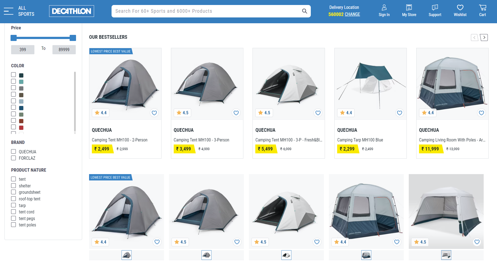

# WebScraping using beautiful Soup 

The way to get information from websites is named WebScraping. In this repo, I want to extract information on a website and catch product, brand, price, currency price, rating and a product detail url.

To solve this problem, I use this [website](https://www.decathlon.in/camping/tents-shelters-15687?id=15687&type=c), it is an Indian sport website, an screenshot is showed follow.

In this case I will capture prices and descriptions of tents.

To capture information is neccessary to import
the libraries `bs4`, `request` and `pandas` in Python.

The result is to get a DataFrame with information of tents showed on website. A sample of 5 products is shown following.

|    | Product                                     | Brand   |   Rating | Currency   | Price   | Description                                                                               |
|---:|:--------------------------------------------|:--------|---------:|:-----------|:--------|:------------------------------------------------------------------------------------------|
| 17 | Camping Tent MH100 - 2-Person - Fresh&Black | QUECHUA |      4.5 | ₹          | 4,499   | https://www.decathlon.in/p/8576112/tents-shelters/camping-tent-mh100-2-person-freshblack  |
| 21 | Trekking Tarp Tent MT900 - 2-Person         | FORCLAZ |      3.9 | ₹          | 16,999  | https://www.decathlon.in/p/8612300/tents-shelters/trekking-tarp-tent-mt900-2-person       |
| 28 | 3-Person Trekking Tent MT900 Ultralight     | FORCLAZ |      4   | ₹          | 22,999  | https://www.decathlon.in/p/8586319/tents-shelters/3-person-trekking-tent-mt900-ultralight |
| 20 | Dome Trekking Tent - 3 person - MT500       | FORCLAZ |      4.2 | ₹          | 9,999   | https://www.decathlon.in/p/8556125/tents-shelters/dome-trekking-tent-3-person-mt500       |
| 15 | Camping tent - MH100  - 3-person - Fresh    | QUECHUA |      4.5 | ₹          | 6,999   | https://www.decathlon.in/p/8641760/tents-shelters/camping-tent-mh100-3-person-fresh       |

Check the jupyter notebbok to more details.

### Bibliography

- Ryan Mitchell. Web Scrapping with Python, 2nd Edition

- [Beautiful Soup Documentation](https://beautiful-soup-4.readthedocs.io/en/latest/)

